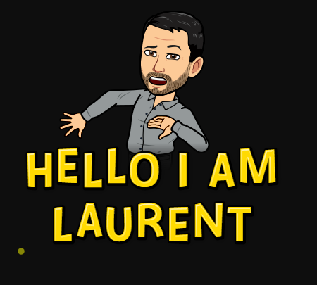

# </src>   Hello, I am **Laurent Gil**

## About me

Passionate by technology and automation, I started my DevOps 🚊journey🚊 roughly 10 years ago in creating a first CI Jenkins pipelines. Few years later, I spread the DevOps culture across the DXC company as DevOps Coach.

During the DXC hours, I have been in charge of the AWS Cloud hosting the CI/CD tools chain. Among those tools, as administrator, I had the opportunity to scale the company Jenkins infrastructure to host more than 20K company jobs spread across more than 200 teams, to administrate JFrog Artifactory and to deploy a monitoring stack to keep everything stable.

This CI/CD tool chain administrator role allowed me to discover the AWS cloud. In accordance with my DevOps culture and because I had to provide the company client with services, I embraced the SRE path.

At the same time, I also discovered Kubernetes and I self-educated until I had enough knowledge to become a Kubernetes evangelist.

Nowadays, I am still passionate about :

* ❤️ cloud 
* ❤️infrastructure
* ❤️kubernetes
* ❤️Coaching
* ❤️DevOps
* ❤️automation

and I do my best to remains at the cutting edge of this technologies and movement.

## 📫 More about me:

<table>

<tr>
<td>

</td>

<td>

</td>

<td>

</td>

</tr>
</table>